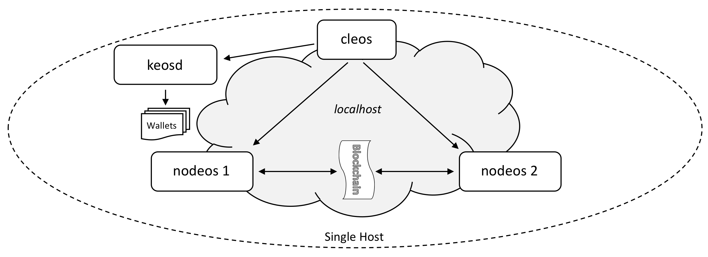

# 本地多节点测试网
---

## 目标

本节介绍如何在单机上配置运行多节点区块链，该方式称为“单机多节点测试网”。配置目标是在单机上建立两个节点，并实现节点间的相互通信。下面给出一个配置实例，结构如图所示，其中涉及`nodeos`、`keosd`和`cleos`这三个命令行应用。



## 准备工作

* [安装EOSIO软件](../../../00_install/index.md)。
* 提供可执行的`nodeos`、`cleos`和`keosd`。如果使用Shell脚本构建EOSIO，确保运行[安装脚本](../../../00_install/01_build-from-source/01_shell-scripts/03_install-eosio-binaries.md)。
* 掌握如何设置[Nodeos选项](../../02_usage/00_nodeos-options.md)启停特定功能。

## 操作步骤

打开四个命令行终端窗口，执行如下步骤
Open four "terminal" windows and perform the following steps:

1. [启动钱包管理器](#1-start-the-wallet-manager)
2. [创建默认钱包](#2-create-a-default-wallet)
3. [加载EOSIO密钥](#3-loading-the-eosio-key)
4. [启动第一个生产者节点]](#4-start-the-first-producer-node)
5. [启动第二个生产者节点](#5-start-the-second-producer-node)
6. [获取节点信息](#6-get-nodes-info)

<span id="1-start-the-wallet-manager"></span>
### 1. 启动钱包管理器

在第一个命令行终端内启动钱包管理应用`keosd`：

```sh
keosd --http-server-address 127.0.0.1:8899
```

成功执行`keosd`后将会显示如下信息：

```console
2493323ms thread-0   wallet_plugin.cpp:39          plugin_initialize    ] initializing wallet plugin
2493323ms thread-0   http_plugin.cpp:141           plugin_initialize    ] host: 127.0.0.1 port: 8899
2493323ms thread-0   http_plugin.cpp:144           plugin_initialize    ] configured http to listen on 127.0.0.1:8899
2493323ms thread-0   http_plugin.cpp:213           plugin_startup       ] start listening for http requests
2493324ms thread-0   wallet_api_plugin.cpp:70      plugin_startup       ] starting wallet_api_plugin
```

在输出信息中查找提示说钱包已经启动监听在127.0.0.1:8899。这表明`keosd`已正确启动，并在设定端口监听。如果在`starting wallet_api_plugin`信息前输出其它信息甚至是报错，需要确诊问题并重启。

一旦`keosd`正常运行，保持命令行窗口运行钱包应用，转向操作下一个窗口。

<span id="2-create-a-default-wallet"></span>
### 2. 创建默认钱包

转向下一个命令行窗口，运行`cleos`创建默认钱包。命令如下：

```sh
cleos --wallet-url http://127.0.0.1:8899  wallet create --to-console
```

正常运行后，`cleos`将显示创建了“默认”钱包，并给出访问钱包应用的密码，提示保存好密码以便使用钱包。输出示例如下：

```console
Creating wallet: default
Save password to use in the future to unlock this wallet.
Without password imported keys will not be retrievable.
"PW5JsmfYz2wrdUEotTzBamUCAunAA8TeRZGT57Ce6PkvM12tre8Sm"
```

`keosd`将在该窗口中生成运行状态输出。该窗口将在随后用于执行`cleos`命令。

<span id="3-loading-the-eosio-key"></span>
### 3. 加载EOSIO密钥

上面步骤运行的私有区块链将生成一个默认的初始密钥。该密钥需要加载到钱包中，命令如下：

```sh
cleos --wallet-url http://127.0.0.1:8899 wallet import --private-key 5KQwrPbwdL6PhXujxW37FSSQZ1JiwsST4cqQzDeyXtP79zkvFD3
```

```console
imported private key for: EOS6MRyAjQq8ud7hVNYcfnVPJqcVpscN5So8BhtHuGYqET5GDW5CV
```

<span id="4-start-the-first-producer-node"></span>
### 4. 启动第一个生产者节点

现在可以启动第一个生产者节点。在第三个命令行窗口中运行如下命令：

```sh
nodeos --enable-stale-production --producer-name eosio --plugin eosio::chain_api_plugin --plugin eosio::net_api_plugin
```

该命令生成一个称为“bios”的特殊生产者。如果至此一切运行正常，`nodeos`输出将显示区块成功生成。

<span id="4-start-the-second-producer-node"></span>
### 5. 启动第二个生产者节点

假定用户在`eos\build`目录中运行上述命令，并在此目录中运行`./eosio_build.sh`脚本构建EOSIO二进制文件。

要启动第二个节点，用户必须首先加载`eosio.bios`智能合约。该智能合约用于直接控制分配给用户账户的资源，并访问其它授权API调用。现在回到第二个命令行窗口，运行如下命令加载智能合约：

```sh
cleos --wallet-url http://127.0.0.1:8899 set contract eosio build/contracts/eosio.bios
```

羡慕创建一个用于生产者的账户，名称为`inita`。为创建账户，首先需要生成该账户关联的密钥，并将生成密钥导入钱包中。

创建密钥的命令如下：

```sh
cleos create key
```

[[提示| 注意事项]]
| 本节后面给出的命令行操作将使用如下私钥/公钥。为了方便用户直接从本节内容中中剪切并粘贴命令，请使用所给出的密钥，而不要使用用户命令`cleos create key`生成的密钥。如果用户需要使用新生成的密钥，请在随后给出的命令中将密钥值替换为新生成的密钥。

上面命令将提示生成公钥和私钥对，输入示例为：


```console
Private key: 5JgbL2ZnoEAhTudReWH1RnMuQS6DBeLZt4ucV6t8aymVEuYg7sr
Public key: EOS6hMjoWRF2L8x9YpeqtUEcsDKAyxSuM1APicxgRU1E3oyV5sDEg
```

下面将私钥导入钱包。如果导入成功，将生成相匹配的公钥。该公钥与上面生成的公钥一致。


```sh
cleos --wallet-url http://127.0.0.1:8899 wallet import 5JgbL2ZnoEAhTudReWH1RnMuQS6DBeLZt4ucV6t8aymVEuYg7sr
```

```console
imported private key for: EOS6hMjoWRF2L8x9YpeqtUEcsDKAyxSuM1APicxgRU1E3oyV5sDEg
```

为创建第二个生产者，需要创建名为`inita`的账户。使用`create account`命令需指定两个公钥，一个是账户自身的密钥，另一个是在用密钥。在本例中，均使用新创建的公钥作为账户自身密钥和在用密钥。命令示例如下：


```sh
cleos --wallet-url http://127.0.0.1:8899 create account eosio inita EOS6hMjoWRF2L8x9YpeqtUEcsDKAyxSuM1APicxgRU1E3oyV5sDEg EOS6hMjoWRF2L8x9YpeqtUEcsDKAyxSuM1APicxgRU1E3oyV5sDEg
```

```console
executed transaction: d1ea511977803d2d88f46deb554f5b6cce355b9cc3174bec0da45fc16fe9d5f3  352 bytes  102400 cycles
#         eosio <= eosio::newaccount            {"creator":"eosio","name":"inita","owner":{"threshold":1,"keys":[{"key":"EOS6hMjoWRF2L8x9YpeqtUEcsDK...
```

生成的账户可指派智能合约并执行有意义的工作。在本教程其它部分内容中，将使用该账户创建简单合约合同。这时，需指定该帐户为区块生产者。

此后，在第四个命令行窗口中启动第二个`nodeos`实例。注意，命令长度显著长于创建第一个生产者时使用的命令。这是为了避免于第一个`nodeos`产生冲突。用户可以复制粘贴如下命令，只需修改其中指定的密钥：


```sh
nodeos --producer-name inita --plugin eosio::chain_api_plugin --plugin eosio::net_api_plugin --http-server-address 127.0.0.1:8889 --p2p-listen-endpoint 127.0.0.1:9877 --p2p-peer-address 127.0.0.1:9876 --config-dir node2 --data-dir node2 --private-key [\"EOS6hMjoWRF2L8x9YpeqtUEcsDKAyxSuM1APicxgRU1E3oyV5sDEg\",\"5JgbL2ZnoEAhTudReWH1RnMuQS6DBeLZt4ucV6t8aymVEuYg7sr\"]
```

新节点的输出内容不多，并将在本节最后一步操作后终止，即将`inita`注册为生产者节点并激活后。下面给出新节点启动后的部分输出：


```console
2393147ms thread-0   producer_plugin.cpp:176       plugin_startup       ] producer plugin:  plugin_startup() end
2393157ms thread-0   net_plugin.cpp:1271           start_sync           ] Catching up with chain, our last req is 0, theirs is 8249 peer dhcp15.ociweb.com:9876 - 295f5fd
2393158ms thread-0   chain_controller.cpp:1402     validate_block_heade ] head_block_time 2018-03-01T12:00:00.000, next_block 2018-04-05T22:31:08.500, block_interval 500
2393158ms thread-0   chain_controller.cpp:1404     validate_block_heade ] Did not produce block within block_interval 500ms, took 3061868500ms)
2393512ms thread-0   producer_plugin.cpp:241       block_production_loo ] Not producing block because production is disabled until we receive a recent block (see: --enable-stale-production)
2395680ms thread-0   net_plugin.cpp:1385           recv_notice          ] sync_manager got last irreversible block notice
2395680ms thread-0   net_plugin.cpp:1271           start_sync           ] Catching up with chain, our last req is 8248, theirs is 8255 peer dhcp15.ociweb.com:9876 - 295f5fd
2396002ms thread-0   producer_plugin.cpp:226       block_production_loo ] Previous result occurred 5 times
2396002ms thread-0   producer_plugin.cpp:244       block_production_loo ] Not producing block because it isn't my turn, its eosio
```

输出显示第二个`nodeos`实例是一个空闲的生产者。要将其转变为活跃生产者，需将`inita`注册为`bios`节点的生产者，并且需操作`bios`节点以更新其生产者计划。

```sh
cleos --wallet-url http://127.0.0.1:8899 push action eosio setprods "{ \"schedule\": [{\"producer_name\": \"inita\",\"block_signing_key\": \"EOS6hMjoWRF2L8x9YpeqtUEcsDKAyxSuM1APicxgRU1E3oyV5sDEg\"}]}" -p eosio@active
```

```console
executed transaction: 2cff4d96814752aefaf9908a7650e867dab74af02253ae7d34672abb9c58235a  272 bytes  105472 cycles
#         eosio <= eosio::setprods              {"version":1,"producers":[{"producer_name":"inita","block_signing_key":"EOS6hMjoWRF2L8x9YpeqtUEcsDKA...
```

至此，成功配置双节点测试网。这时能看到第一个节点不再生成区块，而是在接收区块。可通过运行`get info`命令查看节点运行情况。

<span id="6-get-nodes-info"></span>
### 6. 获取节点信息

获取第一个节点信息：

```sh
cleos get info
```

输出结果示例如下：

```json
{
  "server_version": "223565e8",
  "head_block_num": 11412,
  "last_irreversible_block_num": 11411,
  "head_block_id": "00002c94daf7dff456cd940bd585c4d9b38e520e356d295d3531144329c8b6c3",
  "head_block_time": "2018-04-06T00:06:14",
  "head_block_producer": "inita"
}
```

获取第二个节点信息：

```sh
cleos --url http://127.0.0.1:8889 get info
```

输出结果示例如下：

```json
{
  "server_version": "223565e8",
  "head_block_num": 11438,
  "last_irreversible_block_num": 11437,
  "head_block_id": "00002cae32697444fa9a2964e4db85b5e8fd4c8b51529a0c13e38587c1bf3c6f",
  "head_block_time": "2018-04-06T00:06:27",
  "head_block_producer": "inita"
}
```

本教程随后将介绍如何进一步使用命令运行多机多节点测试网。

