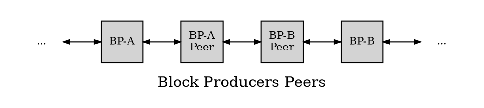

# 区块生成
---

下列概念简要描述了区块生成：

$m = max\_block\_cpu\_usage$

$t =$ block-time

$e =$ last-block-cpu-effort-percent

$w = $block_time_interval = 500 毫秒

$a =$ produce-block-early-amount $= (w - w*e/100)$ 毫秒

$p =$ produce-block-time。 $p = t - a$

$c = billed\_cpu\_in\_block = minimum(m, w - a)$

$n = network tcp/ip latency$

相似硬件、区块链版本和配置的对端验证一般 $<= m$。

**让我们考虑以下四个BP及其网络拓扑的示例，如下所示**

`BP-A`在`p`时刻发送区块，`BP-B`需要在`t`时刻接收到区块，否则将丢弃区块。

如果`BP-A`正在生成如下12个区块：`b(lock) at t(ime) 1`, `bt 1.5`, `bt 2`, `bt 2.5`, `bt 3`, `bt 3.5`, `bt 4`, `bt 4.5`, `bt 5`, `bt 5.5`, `bt 6`, `bt 6.5`，那么`BP-B`到`6.5`时刻需要`bt 6.5`，因此还有`.5` 时刻生成`bt 7`。

注意，`bt 7`的时刻减去`.5`等于`bt 6.5`的时刻，因此`t`是`BP-A`的最后区块时刻，`BP-B`启动其首个区块。 

## 例1

`BP-A`具有50% e, m = 200ms, c = 200ms, n = 0ms, a = 250ms:
`BP-A`发送时刻(t-250ms) <-> `BP-A-Peer`处理200ms，发送时刻为(t - 50ms) <-> `BP-B-Peer`处理200ms，发送时刻为(t + 150ms) <-> `BP-B`接收晚了150ms。

## 例2
`BP-A` 具有40\% e, m = 200ms, c = 200ms, n = 0ms, a = 300ms：
(t-300ms) <-> (+200ms) <-> (+200ms) <-> `BP-B`接收晚了100ms。

## 例3
`BP-A`具有30% e， m = 200ms, c = 150ms, n = 0ms, a = 350ms:
(t-350ms) <-> (+150ms) <-> (+150ms) <-> `BP-B`接收提前50ms。

## 例4
`BP-A`具有25% e ，m = 200ms, c = 125ms, n = 0ms, a = 375ms:
(t-375ms) <-> (+125ms) <-> (+125ms) <-> `BP-B`接收提前125ms。

## 例5
`BP-A`具有10% e ，m = 200ms, c = 50ms, n = 0ms, a = 450ms:
(t-450ms) <-> (+50ms) <-> (+50ms) <-> `BP-B`接收提前350ms。

## 例6
`BP-A` has 10% e，m = 200ms, c = 50ms, n = 15ms, a = 450ms:
(t-450ms) <- +15ms -> (+50ms) <- +15ms -> (+50ms) <- +15ms -> `BP-B` <-> 接收提前305ms。

## 例7
以因特网为例，`BP-A`具有10% e，m = 200ms, c = 50ms, n = 15ms/250ms, a = 450ms:
(t-450ms) <- +15ms -> (+50ms) <- +250ms -> (+50ms) <- +15ms -> `BP-B` <-> 接收提前70ms。

在中继节点上运行`wasm-runtime=eos-vm-jit eos-vm-oc-enable`，可降低验证时间。